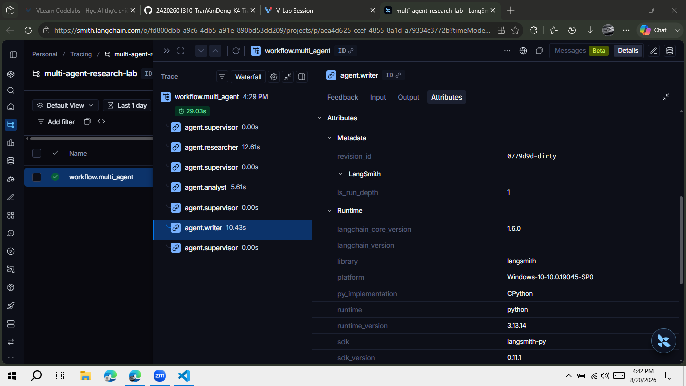

# Trace Evidence

## Verified end-to-end run

- Provider: LangSmith
- Project: `multi-agent-research-lab`
- Query: `Compare single-agent vs multi-agent architectures for AI research tasks`
- Timestamp: 2026-08-20 16:29 (Asia/Bangkok)
- Route: `researcher -> analyst -> writer -> done`
- Sources: 5
- Iterations: 4
- Errors: 0
- Trace duration: 29.03 seconds
- CLI latency: 37.23 seconds
- Token usage: 2,235 input / 1,481 output
- Estimated cost: USD 0.00122

[Open the public end-to-end LangSmith workflow trace](https://smith.langchain.com/public/af6b227d-5a44-4417-ae66-7bbd61ba7358/r/01a01e80-fd78-7030-b5f1-52ae441aa92e?start_time=2026-08-20T09%3A29%3A25.112817Z)

The root trace contains eight nested runs:

- One `workflow.multi_agent` root
- Four `agent.supervisor` routing decisions
- One `agent.researcher` run
- One `agent.analyst` run
- One `agent.writer` run

The repository also includes `reports/trace_export.json`, a local export containing all eight
spans from this verified hierarchical run.

